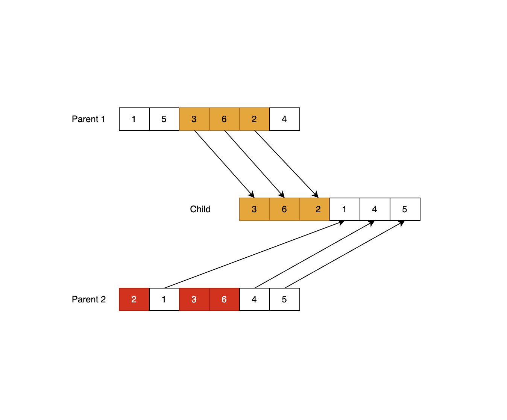
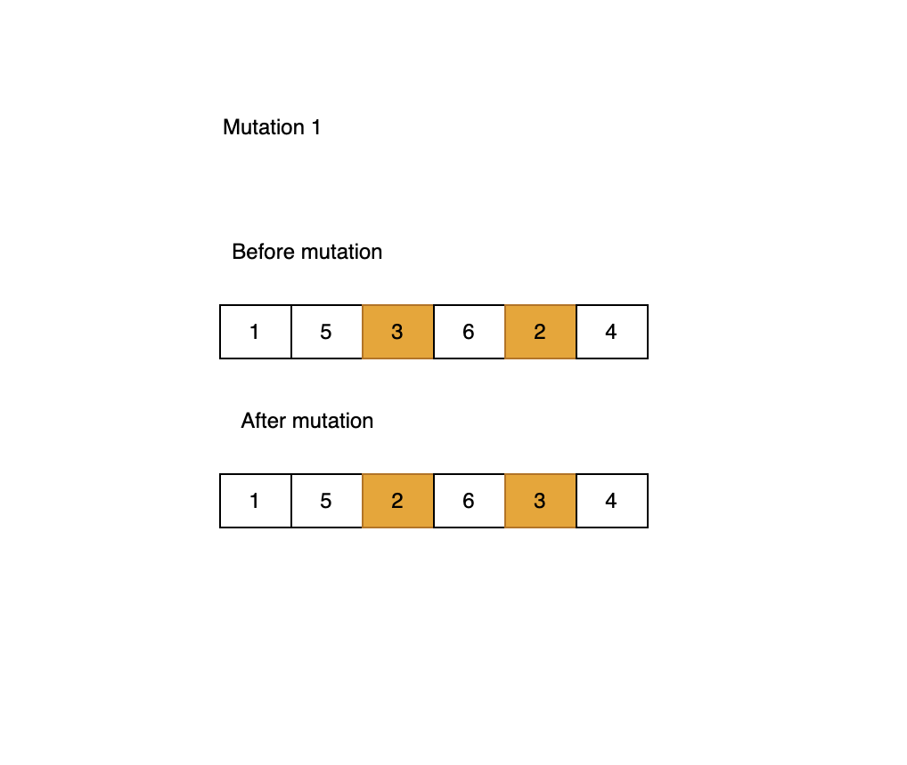
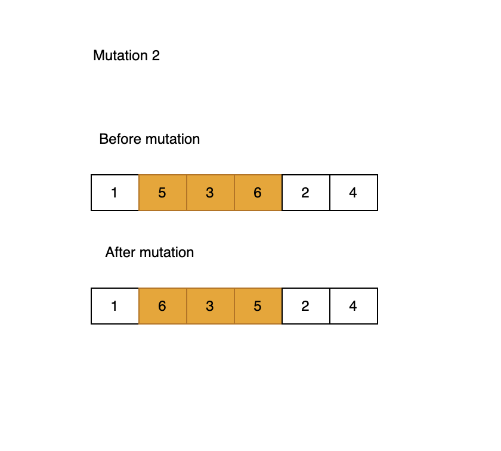
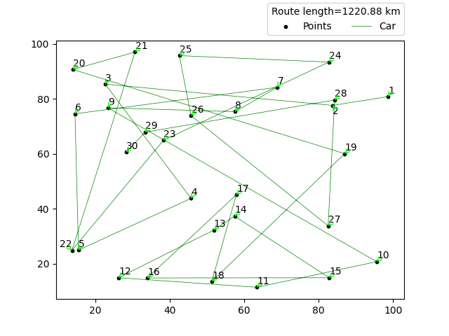
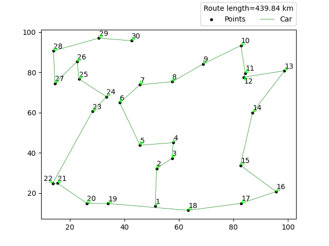

## Travelling salesman problem

> The travelling salesman problem (also called the travelling salesperson problem or TSP) 
> asks the following question: "Given a list of cities and the distances between each pair of
> cities, what is the shortest possible route that visits each city exactly once and returns to the origin city?".

## About project
> The project attempted to optimize the route for the generated points using a genetic 
> algorithm. A certain simplification has been adopted in the project, i.e. the route 
> can start and end at any point. The goal is to find the shortest possible route in the
> optimal time.


## Description of the algorithm
> In the first step, an initial population consisting of randomly generated routes is generated, 
> followed by optimization through the indicated number of iterations. In each iteration, 
> the following occurs:
> 1. Routes evaluation based on length.
> 2. Removal of excessive number of routes.
> 3. Crossing the best rated route.
> 4. A mutation is carried out on the crossed routes.
> 5. Adding crossed routes to the others.

### Routes evaluation
> Route evaluation is done by sorting all routes from shortest to longest.


### Crossover
> The best-rated route is chosen as the first parent. Then, depending on the *crossed_routes* parameter,
> the next best routes are selected. For the crossed_routes=2 parameter, the following crosses will be performed:
> 1. Route 1 will intersect with Route 2.
> 1. Route 1 will intersect with Route 3.
>
> The crossover is performed as follows: Assuming we have a route of 6 points, we try to crossbreed the two parents.
> In parent 1, we select a sequence of points - these points will be the starting points in the child. 
> Then we complete the remaining points from parent number 2 in order.



### Mutation
> Mutations are carried out only on crossed routes. The chance of a mutation is 5%. 
> If a decision is made to carry out a mutation, a draw takes place as a result of which a decision 
> is made which mutation to carry out, the chance is 50%.
>* Mutation 1: Two points are randomly selected and swapped in place.
> 
>* Mutation 2: Select random sequence of points on the route and reverse its order.
> 


## Optimization function
> The function **optimize_routes()** accepts the following parameters:
> 1. points - Generated points in the form of a numpy 2D array.
> 2. initial_population - Number of initial population, default *20*.
> 3. iterations - Number of algorithm iterations, default *1000*.
> 4. generator - Pseudo-random number generator, by default *np.random.default_rng()*.
> 5. crossed_routes - The number of roads to be crossed with the best rated one.

## Example
```python
import numpy as np
from lib.route_utils import optimize_routes
from lib.points import generate_points

points = generate_points(number_of_points=30, seed=10)

GENERATOR = np.random.default_rng(15)

optimized_routes = optimize_routes(
    points,
    initial_population=20,
    iterations=25000,
    generator=GENERATOR,
    crossed_routes=6,
)
```

### Best randomly generated route


### Route after 25000 iterations
